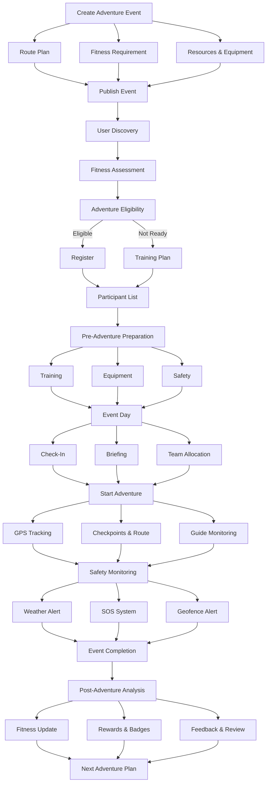

# ADMIN / ORGANIZER

## Adventure Event Workflow

```mermaid
flowchart TD
    A[Create Adventure Event] --> B[Route Plan]
    A --> C[Fitness Requirement]
    A --> D[Resources & Equipment]
    B --> E[Publish Event]
    C --> E
    D --> E
    E --> F[User Discovery]
    F --> G[Fitness Assessment]
    G --> H[Adventure Eligibility]

    H -->|Eligible| I[Register]
    H -->|Not Ready| J[Training Plan]

    I --> K[Participant List]
    J --> K
    K --> L[Pre-Adventure Preparation]

    L --> M[Training]
    L --> N[Equipment]
    L --> O[Safety]

    M --> P[Event Day]
    N --> P
    O --> P

    P --> Q[Check-In]
    P --> R[Briefing]
    P --> S[Team Allocation]

    Q --> T[Start Adventure]
    R --> T
    S --> T

    T --> U[GPS Tracking]
    T --> V[Checkpoints & Route]
    T --> W[Guide Monitoring]

    U --> X[Safety Monitoring]
    V --> X
    W --> X

    X --> Y[Weather Alert]
    X --> Z[SOS System]
    X --> AA[Geofence Alert]

    Y --> AB[Event Completion]
    Z --> AB
    AA --> AB

    AB --> AC[Post-Adventure Analysis]
    AC --> AD[Fitness Update]
    AC --> AE[Rewards & Badges]
    AC --> AF[Feedback & Review]

    AD --> AG[Next Adventure Plan]
    AE --> AG
    AF --> AG
```
